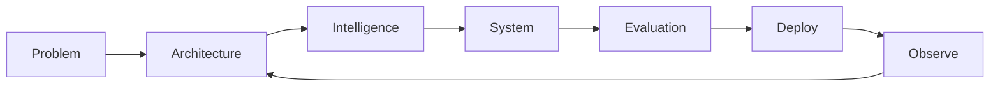

<!-- =========================================================
                       H I T E S H   J I N D A L
                         GitHub Profile README
========================================================== -->

<div align="center">


<br/>


<br/>

<sub>
  AI SYSTEMS &nbsp;·&nbsp; AGENTIC INFRASTRUCTURE &nbsp;·&nbsp; REAL-TIME AI &nbsp;·&nbsp; SOFTWARE ENGINEERING
</sub>

<br/><br/>

<a href="https://veriq-flax.vercel.app">
  
</a>
&nbsp;
<a href="https://www.linkedin.com/in/hitesh-jindal56/">
  
</a>
&nbsp;
<a href="mailto:jindalhitesh564@gmail.com">
  
</a>

</div>

<br/>

---

## `01. PROFILE`

```yaml
name: Hitesh Jindal
based_at: Plaksha University, India

building:
  - intelligent AI products
  - agent evaluation infrastructure
  - real-time LLM systems

interested_in:
  - AI Engineering
  - Agentic Systems
  - AI Evaluation & Reliability
  - Backend / Systems Engineering
  - Applied Machine Learning

philosophy:
  "Build → Measure → Understand → Improve → Ship"
```

I’m a **Computer Science & Artificial Intelligence undergraduate at Plaksha University** interested in engineering AI systems that work beyond controlled demos.

My work lies at the intersection of **LLM agents, evaluation, real-time AI, backend architecture, retrieval systems, and applied machine learning**.

What interests me most isn't simply getting a model to generate the right response. It's designing everything around that model:

> **state · memory · orchestration · evaluation · tools · latency · reliability · product experience**

I like taking an idea from an architecture diagram to something people can actually use.

---

<div align="center">

### `CURRENTLY BUILDING`

```text
┌───────────────────────────────────────────────────────────────────┐
│                                                                   │
│   VERIQ        → Adaptive AI Interview Intelligence               │
│   AGENTEVAL    → Failure Diagnosis for LLM Agents                 │
│                                                                   │
│   CURRENT      → AI Reliability · Real-Time Systems · Agents      │
│                                                                   │
└───────────────────────────────────────────────────────────────────┘
```

</div>

---

## `02. SELECTED WORK`

<table>
<tr>
<td width="50%" valign="top">

### ◈ Veriq
#### AI Interview Intelligence

A real-time AI interviewer designed around **adaptive questioning, evidence collection, voice interaction and structured candidate evaluation**.

Instead of following a fixed question bank, Veriq decides how deeply to explore a topic based on the evolving interview context.

**Engineering**

`LangGraph` `FastAPI` `Next.js`  
`PostgreSQL` `Supabase` `Gemini`

**Core systems**

- Multi-stage interview orchestration
- Context-aware follow-ups
- Claim verification
- Persistent interview state
- Evidence-grounded scoring
- Voice-first interviewing

<br/>

<a href="https://github.com/Hitesh564/Veriq">

</a>
<a href="https://veriq-flax.vercel.app">

</a>

</td>

<td width="50%" valign="top">

### ◈ AgentEval
#### Causal Failure Diagnosis for LLM Agents

An evaluation system for understanding **why multi-step LLM-agent workflows fail**, rather than reporting only whether they succeeded.

It analyzes execution traces, node health and dependency relationships to identify likely failure contributors.

**Engineering**

`Python` `FastAPI` `LangChain`  
`PostgreSQL` `LiteLLM`

**Evaluation**

- Trace-based diagnosis
- Dependency-aware attribution
- Automated benchmarking
- Failure localization
- Remediation insights

**Benchmark**

`73.3% accuracy`  
`76.2% balanced accuracy`

<br/>

<a href="https://github.com/Hitesh564/AgentEval">

</a>

</td>
</tr>
</table>

---

## `03. RESEARCH × APPLIED ML`

### ◈ Explainable Retinal Age Gap

Built an explainable retinal-age estimation pipeline combining **RETFound / Vision Transformers, vascular biomarkers, XGBoost and SHAP**.

```text
23K+ Retinal Images
       │
       ▼
 Image Preprocessing
       │
       ├──── RETFound / ViT ──────────────┐
       │                                   │
       └──── Vessel Segmentation           │
                    │                      │
                    ▼                      │
            Vascular Biomarkers            │
                    │                      │
                    ▼                      ▼
                  XGBoost ───────────► Retinal Age
                                      +
                                   Explanation
```

`PyTorch` · `RETFound` · `OpenCV` · `XGBoost` · `SHAP`

---

## `04. ENGINEERING STACK`

<div align="center">

### Intelligence


`LLMs` · `LangChain` · `LangGraph` · `RAG` · `Hugging Face` · `Gemini` · `Agentic AI`

<br/><br/>

### Systems


`REST` · `WebSockets` · `SQLModel` · `SQLAlchemy` · `Vector Search`

<br/><br/>

### Interface


<br/><br/>

### Engineering


</div>

---

## `05. HOW I BUILD`



The model is only one component.

A production AI system also needs:

```text
                        AI PRODUCT
                            │
           ┌────────────────┼────────────────┐
           │                │                │
           ▼                ▼                ▼
      INTELLIGENCE        SYSTEM          PRODUCT
           │                │                │
       Models / LLM      State / DB       UX / Latency
       Retrieval         APIs             Feedback
       Reasoning         Memory           Reliability
           │                │                │
           └────────────────┼────────────────┘
                            │
                            ▼
                       EVALUATION
```

---

## `06. CURRENT EXPLORATIONS`

```diff
+ LLM agent evaluation & reliability
+ Stateful and adaptive AI systems
+ Real-time voice intelligence
+ Retrieval & context engineering
+ Production LLM architecture
+ System design for AI products

> Going deeper:
  distributed systems
  backend scalability
  AI observability
  agent failure analysis
```

---

## `07. GITHUB`

<div align="center">


</div>

<br/>

<div align="center">


</div>

---

## `08. PRINCIPLES`

<div align="center">

### `BUILD SYSTEMS — NOT WRAPPERS.`

**Measure what the AI does.**  
**Understand how it fails.**  
**Design for uncertainty.**  
**Ship what people can actually use.**

</div>

---

## `09. OPEN CHANNEL`

<div align="center">

Interested in **AI systems, agents, evaluation, ML engineering, or building ambitious software?**

<br/>

<a href="mailto:jindalhitesh564@gmail.com">

</a>

<a href="https://www.linkedin.com/in/hitesh-jindal56/">

</a>

<a href="https://github.com/Hitesh564">

</a>

<br/><br/>


</div>

<br/>

<div align="center">

```text
INTELLIGENCE × ENGINEERING × EXECUTION
```

<i>Learning by building. Improving by measuring. Shipping by iterating.</i>

</div>


