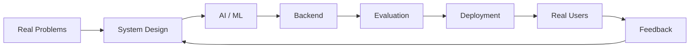

<!-- =========================
     HERO
========================= -->

<p align="center">
  
</p>

<p align="center">
  
</p>

<p align="center">
  <a href="https://github.com/Hitesh564">
    
  </a>
  <a href="https://www.linkedin.com/in/hitesh-jindal56/">
    
  </a>
  <a href="mailto:jindalhitesh564@gmail.com">
    
  </a>
</p>

---

## About Me

I'm **Hitesh Jindal**, a Computer Science & Artificial Intelligence undergraduate at **Plaksha University**, interested in building intelligent systems that go beyond demos and work as real products.

My work sits at the intersection of **AI engineering, agentic systems, backend architecture, real-time applications, and applied machine learning**.

I enjoy problems where the challenge is not simply calling an LLM API, but designing the surrounding system — **state, memory, evaluation, orchestration, retrieval, observability, latency, and user experience**.

Currently exploring how AI systems can become more **adaptive, reliable, evaluable, and useful in production**.

```text
Build → Evaluate → Understand Failure → Improve → Ship
```

---

## Featured Projects

<table>
<tr>
<td width="50%" valign="top">

### 🎙️ Veriq

**AI Interview Intelligence Platform**

A real-time AI interview system that conducts adaptive, voice-first interviews and evaluates candidates using multi-turn reasoning and evidence collection.

**Highlights**

- Adaptive interview orchestration
- Context-aware follow-up generation
- Multi-turn claim verification
- Evidence-grounded evaluation
- Persistent interview state
- Voice-first interaction
- Resume / JD / role-aware interviews

**Stack**

`FastAPI` `LangGraph` `Next.js` `TypeScript` `PostgreSQL` `Supabase` `Gemini`

<p>
  <a href="https://github.com/Hitesh564/Veriq">
    
  </a>
  <a href="https://veriq-flax.vercel.app">
    
  </a>
</p>

</td>

<td width="50%" valign="top">

### 🔬 AgentEval

**Failure Diagnosis for LLM Agents**

An evaluation framework for diagnosing failures in multi-step LLM-agent workflows using execution traces, dependency relationships, and structured health signals.

**Highlights**

- Trace-based agent evaluation
- Dependency-aware root-cause analysis
- Node-level failure diagnosis
- Automated benchmarking
- Failure attribution and remediation insights
- External benchmark validation

**Results**

`73.3% Accuracy` · `76.2% Balanced Accuracy`

**Stack**

`Python` `FastAPI` `LangChain` `PostgreSQL` `LiteLLM`

<p>
  <a href="https://github.com/Hitesh564/AgentEval">
    
  </a>
</p>

</td>
</tr>
</table>

---

## 🧠 Other Work

### Explainable Retinal Age Gap Prediction

Built an explainable deep-learning pipeline for estimating biological retinal age using **RETFound / Vision Transformers**, vascular feature extraction, XGBoost, and SHAP.

Worked across **23K+ retinal images** from ODIR-5K and BRSET with preprocessing, vessel analysis, biomarker extraction, and interpretability.

`PyTorch` `ViT` `RETFound` `XGBoost` `SHAP` `OpenCV`

---

## ⚙️ What I Like Building



My strongest interests are:

- 🤖 **LLM & Agentic Systems**
- 🧠 **AI Evaluation & Reliability**
- ⚡ **Real-Time AI Applications**
- 🏗️ **Backend & System Architecture**
- 🔎 **RAG & Retrieval Systems**
- 🎙️ **Voice AI**
- 📊 **Applied Machine Learning**
- 🚀 **Zero-to-One Product Engineering**

---

## 🛠️ Tech Stack

### Languages

<p align="left">
  
</p>

### AI / Machine Learning

<p align="left">
  
</p>

`LangChain` · `LangGraph` · `Hugging Face` · `Gemini` · `RAG` · `LLM Agents` · `Scikit-learn` · `XGBoost` · `SHAP`

### Backend & Data

<p align="left">
  
</p>

`REST APIs` · `WebSockets` · `SQLModel` · `SQLAlchemy` · `Vector Search`

### Frontend

<p align="left">
  
</p>

### Developer Tools

<p align="left">
  
</p>

---

## 🧩 How I Think About AI Products

```text
                   ┌────────────────────┐
                   │      USER NEED     │
                   └─────────┬──────────┘
                             │
                             ▼
                   ┌────────────────────┐
                   │   PRODUCT LOGIC    │
                   └─────────┬──────────┘
                             │
               ┌─────────────┴─────────────┐
               ▼                           ▼
       ┌───────────────┐           ┌───────────────┐
       │  AI / AGENTS  │           │   BACKEND     │
       └───────┬───────┘           └───────┬───────┘
               │                           │
               └─────────────┬─────────────┘
                             ▼
                   ┌────────────────────┐
                   │ STATE / MEMORY / DB│
                   └─────────┬──────────┘
                             ▼
                   ┌────────────────────┐
                   │    EVALUATION      │
                   └─────────┬──────────┘
                             ▼
                   ┌────────────────────┐
                   │  OBSERVE & IMPROVE │
                   └────────────────────┘
```

A good AI product is rarely just the model.

The interesting engineering is usually everything around it:

**context → state → orchestration → tools → evaluation → latency → reliability → UX**

---

## 📈 GitHub Activity

<p align="center">
  
  
</p>

<p align="center">
  
</p>

---

## 🚀 Current Focus

```yaml
currently_building:
  - AI interview intelligence
  - LLM agent evaluation systems
  - production-grade AI applications

learning_deeper:
  - agent reliability
  - real-time AI systems
  - scalable backend architecture
  - AI evaluation
  - system design

interested_in:
  - AI / ML Engineering
  - Software Engineering
  - Applied AI Research
  - Agentic Systems
```

---

## 💡 Engineering Principles

> **Build systems, not wrappers.**

> **Evaluate AI instead of assuming it works.**

> **Understand failure modes before scaling.**

> **Ship something people can actually use.**

---

## 🤝 Let's Connect

I'm always interested in conversations around:

- AI engineering
- agent architectures
- LLM evaluation
- applied ML
- research-to-product work
- interesting engineering problems

<p align="center">
  <a href="mailto:jindalhitesh564@gmail.com">
    
  </a>

  <a href="https://www.linkedin.com/in/hitesh-jindal56/">
    
  </a>

  <a href="https://github.com/Hitesh564">
    
  </a>
</p>

---

<p align="center">
  <i>Learning by building. Improving by evaluating. Shipping by iterating.</i>
</p>

<p align="center">
  
</p>
