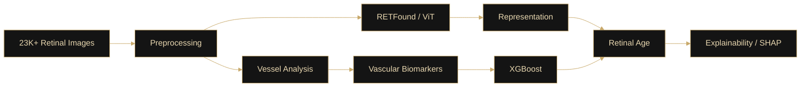
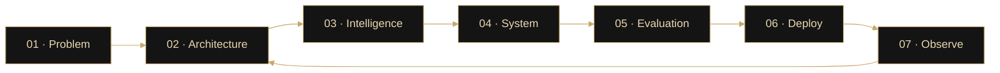
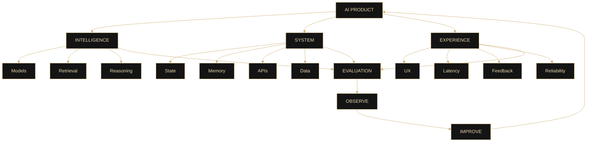

<!-- =========================================================
                      H I T E S H   J I N D A L
                  AI • SYSTEMS • ENGINEERING
========================================================== -->

<div align="center">


<br/>


<br/>

<sub>
AI SYSTEMS &nbsp;·&nbsp; AGENTIC INFRASTRUCTURE &nbsp;·&nbsp; REAL-TIME AI &nbsp;·&nbsp; SOFTWARE ENGINEERING
</sub>

<br/><br/>

<a href="https://veriq-flax.vercel.app">

</a>
&nbsp;
<a href="https://www.linkedin.com/in/hitesh-jindal56/">

</a>
&nbsp;
<a href="mailto:jindalhitesh564@gmail.com">

</a>

</div>

<br/>

---

# `01. PROFILE`

<div align="center">

### Building intelligent systems that survive beyond the demo.

</div>

<br/>

<table>
<tr>
<td width="50%" valign="top">

### ◈ ENGINEERING

I’m **Hitesh Jindal**, a Computer Science & Artificial Intelligence undergraduate at **Plaksha University**.

I enjoy building AI products where the difficult part is not simply calling a model API, but designing the surrounding system.

My work currently sits around:

- AI engineering
- agentic systems
- real-time AI
- backend architecture
- AI evaluation
- applied machine learning

</td>

<td width="50%" valign="top">

### ◈ SYSTEMS THINKING

The parts of AI systems I find most interesting are:

- state & memory
- orchestration
- retrieval
- evaluation
- latency
- observability
- reliability
- product experience

I like moving from:

**idea → architecture → implementation → evaluation → deployment**

</td>
</tr>
</table>

<br/>

<div align="center">

### `BUILD → MEASURE → UNDERSTAND → IMPROVE → SHIP`

</div>

<br/>

> **My goal is not just to make AI generate good outputs — it is to engineer systems that behave reliably, adapt to context, and create measurable value.**

---

# `02. CURRENT SIGNAL`

<div align="center">

<table>
<tr>

<td align="center" width="33%">

### `BUILDING`

**Adaptive AI Systems**

Stateful agents, contextual reasoning, real-time interaction.

</td>

<td align="center" width="33%">

### `MEASURING`

**AI Reliability**

Evaluation, failure diagnosis, benchmarking, evidence.

</td>

<td align="center" width="33%">

### `LEARNING`

**Systems at Scale**

Distributed systems, backend scalability, observability.

</td>

</tr>
</table>

</div>

---

# `03. SELECTED WORK`

<table>
<tr>

<td width="50%" valign="top">

## ◈ Veriq

### AI Interview Intelligence Platform

A real-time AI interviewer designed around **adaptive questioning, contextual follow-ups, voice interaction, evidence collection, and structured evaluation**.

Instead of following a static question bank, Veriq maintains interview state and decides how deeply to explore a topic based on candidate responses.

### Core Engineering

- Multi-stage interview orchestration
- Context-aware follow-ups
- Multi-turn claim verification
- Persistent interview state
- Evidence-grounded scoring
- Voice-first interaction
- Resume / JD / role-aware interviews

### Stack

`LangGraph` `FastAPI` `Next.js`  
`TypeScript` `PostgreSQL` `Supabase` `Gemini`

<br/>

<a href="https://github.com/Hitesh564/Veriq">

</a>

<a href="https://veriq-flax.vercel.app">

</a>

</td>


<td width="50%" valign="top">

## ◈ AgentEval

### Failure Diagnosis for LLM Agents

An evaluation framework for understanding **why multi-step LLM-agent workflows fail**, rather than only reporting whether they succeeded.

AgentEval analyzes execution traces, node-level health signals, and dependency relationships to identify probable failure contributors.

### Core Engineering

- Trace-based evaluation
- Dependency-aware attribution
- Root-cause localization
- Failure remediation insights
- Automated benchmarking
- External benchmark validation

### Benchmark

**73.3% Accuracy**  
**76.2% Balanced Accuracy**

### Stack

`Python` `FastAPI` `LangChain`  
`PostgreSQL` `LiteLLM`

<br/>

<a href="https://github.com/Hitesh564/AgentEval">

</a>

</td>

</tr>
</table>

---

# `04. RESEARCH × APPLIED ML`

## ◈ Explainable Retinal Age Gap

Built an explainable retinal-age estimation pipeline using **RETFound / Vision Transformers, vascular biomarkers, XGBoost, and SHAP**.

Worked across **23K+ retinal images** from ODIR-5K and BRSET.



`PyTorch` · `RETFound` · `OpenCV` · `XGBoost` · `SHAP`

---

# `05. ENGINEERING STACK`

<div align="center">

### INTELLIGENCE


<br/>

`LLMs` · `LangChain` · `LangGraph` · `RAG` · `Hugging Face` · `Gemini` · `Agentic AI`

<br/><br/>

### SYSTEMS & DATA


<br/>

`REST APIs` · `WebSockets` · `SQLModel` · `SQLAlchemy` · `Vector Search`

<br/><br/>

### INTERFACE


<br/><br/>

### ENGINEERING


</div>

---

# `06. HOW I BUILD`

<div align="center">

### From a problem to a system that can be measured.

</div>



<br/>

<table>
<tr>

<td width="33%" valign="top">

### ◈ Intelligence Layer

- LLMs / models
- retrieval
- reasoning
- prompting
- agents
- context

</td>

<td width="33%" valign="top">

### ◈ Systems Layer

- APIs
- state
- memory
- databases
- orchestration
- reliability

</td>

<td width="33%" valign="top">

### ◈ Product Layer

- latency
- UX
- feedback loops
- observability
- evaluation
- real users

</td>

</tr>
</table>

<br/>

<div align="center">

### `MODEL ≠ PRODUCT`

A useful AI product is the combination of:

`INTELLIGENCE × SYSTEMS × EVALUATION × EXPERIENCE`

</div>

---

# `07. CURRENT EXPLORATIONS`

<table>

<tr>

<td width="50%" valign="top">

## ◈ NOW

### Systems I’m actively exploring

**Agent Evaluation & Reliability**  
Understanding why agent workflows fail and how to measure them.

**Adaptive AI Systems**  
Maintaining state, context, memory, and dynamic behavior over long-running interactions.

**Real-Time AI**  
Reducing latency across speech, inference, orchestration, and response pipelines.

**Context Engineering**  
Retrieval, memory, prompt construction, and information selection.

</td>

<td width="50%" valign="top">

## ◈ NEXT DEPTH

### Areas I’m going deeper into

**Distributed Systems**  
Coordination, consistency, scaling, and failure.

**Backend Scalability**  
Designing systems that survive increased load and complexity.

**AI Observability**  
Understanding what intelligent systems are doing internally.

**Agent Failure Analysis**  
Tracing failures across multi-step AI workflows.

**Evaluation Methodology**  
Moving beyond anecdotal quality toward measurable performance.

</td>

</tr>

</table>

<br/>

<div align="center">

```text
CURRENT MODE

BUILD SYSTEMS THAT CAN
THINK  ·  ADAPT  ·  FAIL  ·  BE MEASURED  ·  IMPROVE
```

</div>

---

# `08. ENGINEERING VIEW`



<div align="center">

### The model is one component.

The system around it determines whether it becomes a **demo** or a **product**.

</div>

---

# `09. GITHUB`

<div align="center">

### Code tells one part of the story.

<br/>


<br/><br/>


<br/><br/>


</div>

<br/>

<div align="center">


</div>

---

# `10. PRINCIPLES`

<div align="center">

## `BUILD SYSTEMS — NOT WRAPPERS.`

<br/>

<table>

<tr>

<td align="center" width="25%">

### MEASURE

what the AI  
actually does

</td>

<td align="center" width="25%">

### UNDERSTAND

how and why  
it fails

</td>

<td align="center" width="25%">

### DESIGN

for uncertainty  
and change

</td>

<td align="center" width="25%">

### SHIP

what people  
can actually use

</td>

</tr>

</table>

</div>

---

# `11. OPEN CHANNEL`

<div align="center">

### Interested in AI systems, agents, evaluation, ML engineering, or ambitious software?

<br/>

<a href="mailto:jindalhitesh564@gmail.com">

</a>

&nbsp;

<a href="https://www.linkedin.com/in/hitesh-jindal56/">

</a>

&nbsp;

<a href="https://github.com/Hitesh564">

</a>

<br/><br/>


<br/><br/><br/>

`INTELLIGENCE × ENGINEERING × EXECUTION`

<br/><br/>

<i>Learning by building. Improving by measuring. Shipping by iterating.</i>

</div>

<br/>


